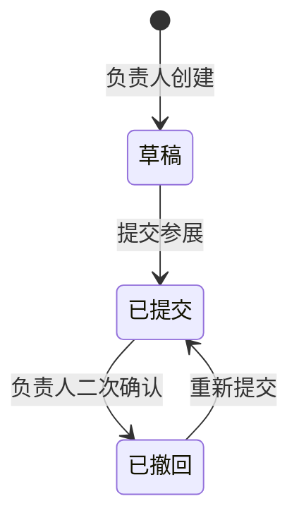

# 参赛作品录入与审计系统

版本：2026-07-14  
赛事：溯造 MiniGame 游戏开发大赛  
主题：宇宙  
宣言：溯求本源，造物不止

## 1. 目标

参赛者使用与投票相同的“姓名、队伍、邮箱六位验证码”账户进入参赛者工作台。工作台负责草稿、作品提交、成员权限、素材版本与撤回流程，并与公开星图、投票和管理员审计保持一致。

视觉上，工作台是赛事观测站的任务控制端。它使用坐标、轨道、信号与审计时间轴表达状态，同时保证表单、权限和风险提示清晰可读。

## 2. 三个独立时间

| 时间 | 作用 | 自动行为 |
| --- | --- | --- |
| 参展提交截止时间 | 判断提交或关键修改是否补交 | 截止秒内提交算按时，晚一秒算补交 |
| 投票截止时间 | 锁定选票 | 截止后不能新增、撤回或替换选票 |
| 宇宙点亮时间 | 发布最终结果 | 仅由管理员手动触发，不依赖前两项 |

管理员调整参展截止时间必须写入审计，但不会追溯清除已经产生的补交标记。

## 3. 作品状态

- 草稿只要求暂定作品名，不公开，也不能投票。
- 已提交立即进入星图、航线、搜索与作品详情。
- 已撤回不公开，不接受新票。系统立即从所有有效选票中移除该作品并释放轨道槽位。
- 撤回前的选票保留为审计记录，但重新提交后不会自动恢复。
- 禁止物理删除作品。

## 4. 提交条件与补交规则

首次提交需要：

- 游戏名称
- 游戏简介
- 游戏封面
- 演示视频
- 游戏下载地址
- 负责人姓名
- 队伍名称
- 至少一项制作人员信息

创作手记、成员头像、成员职能和一句话介绍可选。

补交触发条件：

- 参展截止时间后首次提交
- 截止后撤回再提交
- 作品曾按时提交，但截止后修改游戏下载地址

普通内容在截止后的修改不会触发补交。下载地址修改需要网页内二次确认，并永久保存修改前后的完整地址。补交标记不会因改回旧地址而自动消失。管理员可以依据审计撤销当次标记，后续再次触发时系统仍会重新标记。

补交标记显示于星图近距离观测、自动航线、搜索结果、二维列表和作品详情。补交作品仍可正常获得投票。

## 5. 账户、角色与成员

### 负责人

- 每个作品只有一个负责人邮箱。
- 负责人可编辑作品、管理队友、提交和撤回作品。
- 负责人不能把权限转移给其他人。
- 管理员可为既有作品绑定或纠错负责人邮箱，操作立即生效并写入审计。

### 队友

- 负责人填写姓名和邮箱后，权限立即生效，不需要接受邀请。
- 系统发送通知邮件，包含赛事、作品、负责人和登录入口，不包含永久授权链接。
- 首次验证码登录后显示为已登录，此前显示“待首次登录”。
- 队友可以编辑作品内容，只能修改自己的姓名、头像与职能。
- 队友不能管理成员、转移所有权、提交、撤回或删除作品。
- 被移除后权限立即失效。已打开页面的下一次保存由服务器拒绝，并提示权限已经变更。

### 唯一归属

- 当前负责人和当前队友不能负责或加入第二款作品。
- 被移除的历史队友可以加入或创建另一款作品。
- 负责人邮箱和所有历史队友邮箱永久禁止给原作品投票。
- 自投判断仅依据已验证邮箱，不再依赖姓名或队伍文本匹配。

## 6. 媒体规则

- 封面：上传图片或外部图片地址。
- 演示：上传视频或公开视频链接，上传视频优先。
- 上传视频最大 200 MB。
- 公共链接支持直接播放的 MP4、WebM，以及哔哩哔哩、腾讯视频和 YouTube 页面。
- 下载项只保留一个“游戏下载地址”。

每次上传永久记录：原文件名、大小、MIME 类型、SHA-256、上传者邮箱和上传时间。

- 封面与头像的历史文件持续保留。
- 被替换的上传视频保留 7 天供管理员复核，之后删除文件实体。
- 视频文件删除后，元数据、替换时间与审计记录永久保留。

## 7. 审计

以下事件保留完整审计：

- 草稿创建、内容保存、提交、重新提交和撤回
- 负责人绑定与管理员纠错
- 队友添加、恢复、移除与首次登录
- 成员资料和头像修改
- 下载地址每次修改的完整前后值
- 素材文件元数据与历史版本
- 自动补交判定和管理员撤销补交
- 赛事时间修改
- 选票更新、作品撤回导致的选票失效、违规票删除
- 同票裁定、结果点亮与结果撤回

管理员后台支持按作品和邮箱查询完整记录，并显示精确到秒的北京时间。

## 8. 主要接口

| 方法 | 路径 | 权限 | 说明 |
| --- | --- | --- | --- |
| GET | `/api/participant/workspace` | 已登录 | 获取当前邮箱所属作品与角色 |
| POST | `/api/participant/games` | 已登录且未归属 | 创建草稿 |
| PUT | `/api/participant/games/:id` | 负责人或当前队友 | 保存作品内容，带版本冲突检查 |
| POST | `/api/participant/games/:id/submit` | 负责人 | 提交或重新提交 |
| POST | `/api/participant/games/:id/withdraw` | 负责人 | 撤回并使相关选票失效 |
| POST | `/api/participant/games/:id/members` | 负责人 | 添加或恢复队友 |
| DELETE | `/api/participant/games/:id/members/:memberId` | 负责人 | 立即移除队友权限 |
| PUT | `/api/participant/games/:id/members/:memberId` | 本人或负责人 | 修改成员资料 |
| PUT | `/api/admin/games/:id/owner` | 管理员 | 绑定或纠错负责人 |
| DELETE | `/api/admin/games/:id/late` | 管理员 | 填写原因后撤销补交标记 |
| GET | `/api/admin/audit` | 管理员 | 查询完整审计 |

## 9. 关键交互反馈

- 保存采用修订号校验，避免两个页面互相覆盖。
- 截止后修改下载地址必须在站内确认，确认前不保存。
- 提交与撤回均在站内确认，不调用系统级弹窗。
- 所有上传显示进行中状态，视频上传期间明确提示保持页面开启。
- 手机端将工作台折叠为单列，主要操作保持至少 44 像素点击高度。
- 公开详情中，上传视频静音播放；支持的平台页面在站内播放器展示，未知链接提供外部打开入口。
